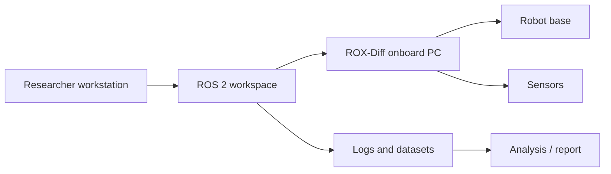

# Project title

<!--
Copy this file into a new folder under docs/Projects/<project-slug>/index.md.
Replace all TODO fields. Delete sections that are clearly not relevant, but do not delete safety, setup, data, or handover information without a reason.
-->

!!! note "How to use this template"

    This template is for ROX-Diff research, student projects, integration work, and temporary technical tests. Write it so that a new maintainer can understand and reproduce the project without relying on the original author.

## Short summary

**One-sentence summary:** TODO: Explain the project in one sentence.

**Longer summary:** TODO: Explain the motivation, what was built or tested, and how it relates to the ROX-Diff, Aalto, and/or TwinFlow.

## Project metadata

| Field | Value |
|---|---|
| Project type | TODO: Research / Student / Temporary test / Integration / Demo |
| Status | TODO: Planned / Active / Paused / Completed / Archived |
| Start date | TODO: YYYY-MM-DD |
| End date | TODO: YYYY-MM-DD or ongoing |
| Main maintainer | TODO: Name and contact |
| Backup contact | TODO: Name and contact |
| Supervisor / project owner | TODO: Name and contact |
| Related course / thesis / work package | TODO |
| Related repository | TODO: Link or internal path |
| Data location | TODO: Link or internal path |
| Robot affected | TODO: ROX-Diff ID / simulation only / external device only |
| Safety impact | TODO: None / low / medium / high |
| Last verified | TODO: YYYY-MM-DD, by whom |

## Quick start

Use this section for the fastest safe path from zero to a working demo or test run.

``` bash title="Minimal startup commands"
# TODO: Activate environment
# source /opt/ros/<ros-distro>/setup.bash
# source ~/ros2_ws/install/setup.bash

# TODO: Start required launch file
# ros2 launch <package> <launch_file>.py
```

Expected result:

``` text
TODO: Describe what the user should see when the system works.
Example: RViz opens, /scan publishes, robot appears in map, controller becomes active.
```

!!! warning "Before running on the real robot"

    Confirm that the test area is clear, emergency stop is reachable, safety scanners are active, and the current project is approved for real-robot operation. If not sure, run in simulation first.

## System overview

Explain the project architecture. Include the robot, external PCs, sensors, network, data flow, and software nodes.



## Scope

### In scope

- TODO: What this project does.
- TODO: What components or software are modified.
- TODO: What experiments are covered.

### Out of scope

- TODO: What this project intentionally does not cover.
- TODO: What should not be assumed from this project.

## Hardware used

| Item | Details |
|---|---|
| Robot | TODO: ROX-Diff robot ID / simulation only |
| Onboard PC | TODO: hostname, OS, relevant hardware details |
| Client PC | TODO: laptop/workstation details |
| Sensors | TODO: LiDAR, safety scanner, camera, IMU, external sensors |
| Network equipment | TODO: router, switch, Wi-Fi, Ethernet, VLAN, etc. |
| External hardware | TODO: payload, mount, arm, charger, IO board, test rig |
| Safety devices | TODO: emergency stop, safety scanner zones, wireless E-stop |

!!! danger "Sensitive details"

    Do not include passwords, private keys, private Wi-Fi credentials, or unrestricted internal network details in public documentation.

## Software used

| Component | Version / branch | Notes |
|---|---|---|
| Operating system | TODO | Example: Ubuntu 22.04 |
| ROS 2 distribution | TODO | Example: Humble, Iron, Jazzy |
| Neobotix packages | TODO | Repository URL, branch, commit |
| Project packages | TODO | Repository URL, branch, commit |
| Simulation tools | TODO | Gazebo, RViz, custom simulator |
| Python packages | TODO | Requirements file or environment name |
| Other dependencies | TODO | Docker, Node.js, MQTT, database, etc. |

## Repository and file locations

| Resource | Location | Notes |
|---|---|---|
| Main repository | TODO | Branch and commit used for latest working version |
| Documentation folder | TODO | This project folder |
| Configuration files | TODO | Parameters, launch files, YAML files |
| Maps | TODO | Map files used in experiments |
| Calibration files | TODO | Camera/LiDAR/TF calibration, if any |
| Bags / logs | TODO | rosbag, CSV, video, screenshots |
| Analysis scripts | TODO | Notebook or scripts used to generate results |

## Setup from a clean workstation

Write these steps as if the reader has a fresh computer and no project memory.

### 1. Prerequisites

- TODO: Operating system
- TODO: ROS 2 version
- TODO: Access rights
- TODO: Network requirements
- TODO: Physical lab access or simulation alternative

### 2. Clone repositories

``` bash title="Clone project repositories"
mkdir -p ~/rox_projects
cd ~/rox_projects

# TODO: Replace with real repository URLs
git clone <repository-url>
cd <repository-name>
git checkout <branch-or-commit>
```

### 3. Install dependencies

=== "ROS 2 packages"

    ``` bash
    cd ~/ros2_ws
    rosdep update
    rosdep install --from-paths src --ignore-src -r -y
    colcon build --symlink-install
    source install/setup.bash
    ```

=== "Python environment"

    ``` bash
    python3 -m venv .venv
    source .venv/bin/activate
    pip install -r requirements.txt
    ```

=== "Docker"

    ``` bash
    docker compose up --build
    ```

### 4. Configure environment

``` bash title="Environment variables"
# TODO: Replace values with the project-specific configuration.
export ROS_DOMAIN_ID=<domain-id>
export RMW_IMPLEMENTATION=<rmw-implementation>
export ROBOT_NAME=<robot-name>
```

### 5. Verify installation

``` bash title="Basic ROS 2 checks"
ros2 doctor
ros2 topic list
ros2 node list
```

Expected output:

``` text
TODO: Add the expected topics, nodes, or health checks.
```

## Operating procedure

### Startup

1. TODO: Prepare the area.
2. TODO: Power on required hardware.
3. TODO: Connect workstation to the correct network.
4. TODO: Start robot-side software.
5. TODO: Start workstation-side software.
6. TODO: Confirm topics, TF tree, localization, and safety status.

### Normal run

``` bash title="Run command"
# TODO: Main command for normal operation
ros2 launch <package> <launch_file>.py
```

### Shutdown

1. TODO: Stop motion commands.
2. TODO: Stop launch files cleanly.
3. TODO: Save logs.
4. TODO: Return robot to charging/storage state.
5. TODO: Record any issues in the project log.

## Experiments and validation

| Experiment ID | Purpose | Setup | Success criteria | Data saved |
|---|---|---|---|---|
| EXP-001 | TODO | TODO | TODO | TODO |
| EXP-002 | TODO | TODO | TODO | TODO |

### Example experiment record

``` text title="Experiment note format"
Date:
Operator:
Robot configuration:
Software branch/commit:
Map/configuration:
Command used:
Observed result:
Data/log location:
Issues:
Next action:
```

## Data management

| Data type | Save location | Format | Retention / archive note |
|---|---|---|---|
| rosbag logs | TODO | `.db3`, `.mcap`, etc. | TODO |
| Video/images | TODO | `.mp4`, `.png`, `.jpg` | TODO |
| Maps | TODO | `.yaml`, `.pgm`, `.png` | TODO |
| Configuration snapshots | TODO | `.yaml`, `.toml`, `.json` | TODO |
| Analysis outputs | TODO | `.csv`, `.ipynb`, figures | TODO |

!!! info "Configuration snapshots"

    Save the exact parameter files, launch files, map files, and commit hashes used for important experiments. Results are hard to reproduce without them.

## Safety notes

| Risk | Mitigation | Responsible person |
|---|---|---|
| Unexpected robot motion | TODO: Use simulation first, clear test area, keep E-stop reachable | TODO |
| Collision with people or objects | TODO: Restricted area, low speed, safety scanner active | TODO |
| Battery / charging issue | TODO: Follow local charging procedure | TODO |
| Network or command delay | TODO: Local stop method, avoid unsafe remote operation | TODO |
| Payload or mount failure | TODO: Mechanical check before motion | TODO |

!!! danger "Stop condition"

    Stop the test immediately if the robot behaves unexpectedly, localization is wrong, safety devices are disabled, a person enters the test area, or the operator loses reliable control.

## Known issues and limitations

| Issue | Impact | Workaround | Status |
|---|---|---|---|
| TODO | TODO | TODO | TODO |

## Troubleshooting

??? question "ROS 2 nodes are not visible"

    Check that all machines use the correct ROS 2 distribution, `ROS_DOMAIN_ID`, middleware configuration, and network connection.

??? question "Robot does not move"

    Check emergency stop, safety scanner state, controller state, battery level, joystick/manual mode, and whether the correct command topic is being published.

??? question "Localization is unstable"

    Check the map, initial pose, TF tree, laser scan topic, time synchronization, and whether the environment has changed.

## Results and current status

Summarize the current state honestly.

| Result | Status | Evidence |
|---|---|---|
| TODO: Basic setup works | TODO: Yes/No/Partial | TODO: Link to log, screenshot, or note |
| TODO: Simulation works | TODO | TODO |
| TODO: Real robot test completed | TODO | TODO |
| TODO: Data archived | TODO | TODO |

## Handover notes

### What works now

- TODO

### What does not work yet

- TODO

### What the next maintainer should do first

1. TODO
2. TODO
3. TODO

### People to contact

| Topic | Contact |
|---|---|
| Robot access | TODO |
| Safety approval | TODO |
| Software repository | TODO |
| Data archive | TODO |
| Project supervision | TODO |

## Archive checklist

Before marking the project as completed or archived:

- [ ] Project status is updated in the metadata table.
- [ ] All important code is pushed to the correct repository.
- [ ] Branches and commits used for final results are recorded.
- [ ] Setup instructions have been tested.
- [ ] Logs, bags, maps, photos, and analysis outputs are saved in a shared location.
- [ ] Known issues and incomplete work are documented.
- [ ] Safety-relevant changes are reported to the robot maintainer.
- [ ] Temporary files on lab computers are cleaned or documented.
- [ ] Next-step recommendation is written clearly.

## Change log

| Date | Author | Change |
|---|---|---|
| YYYY-MM-DD | TODO | Created project page |

